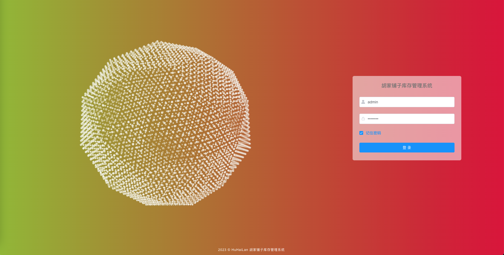
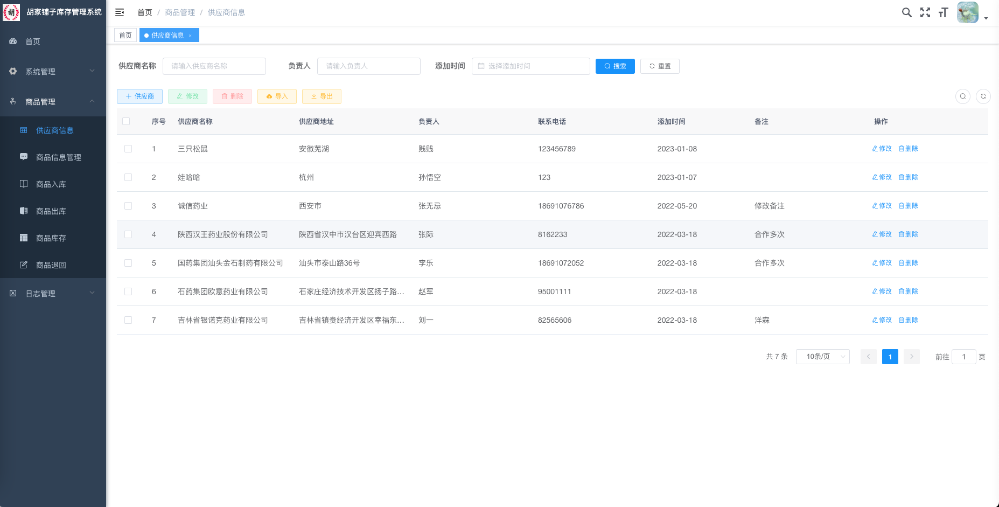
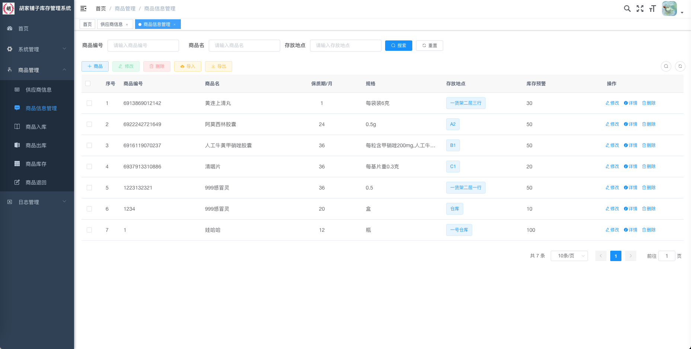
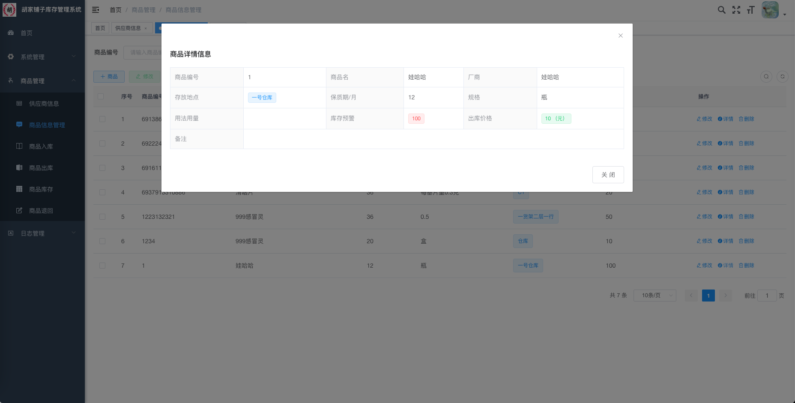
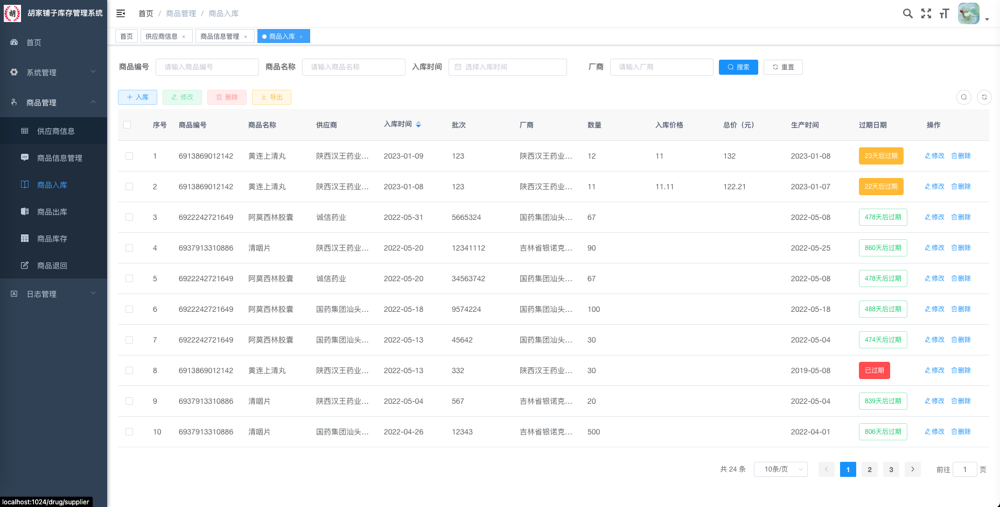
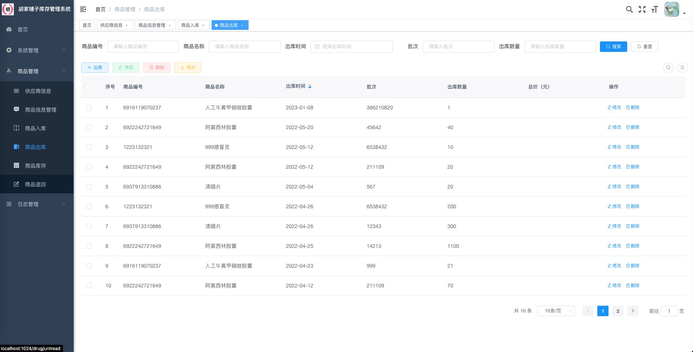
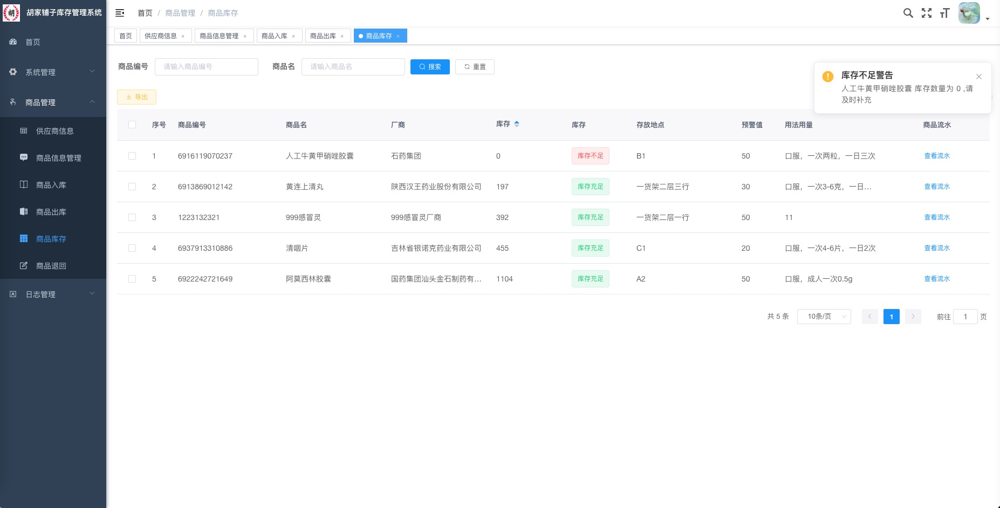
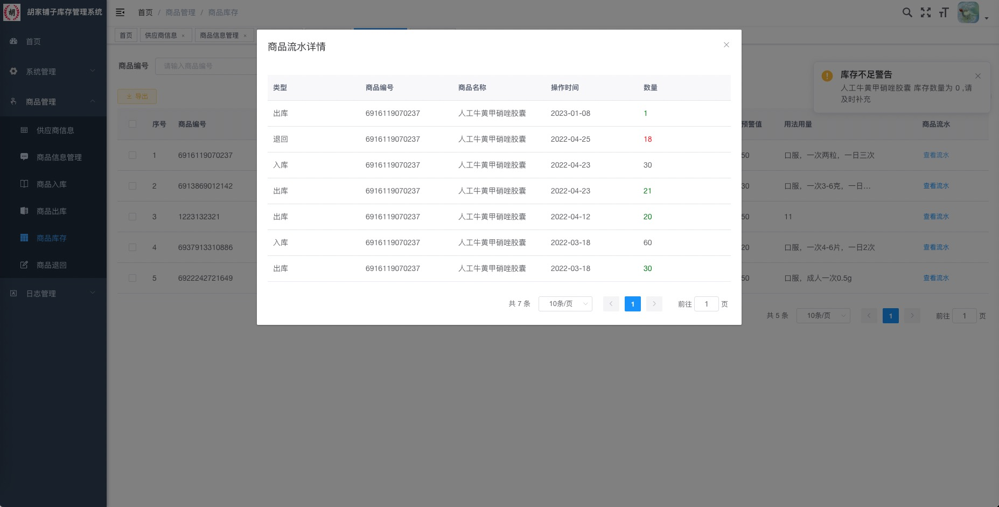
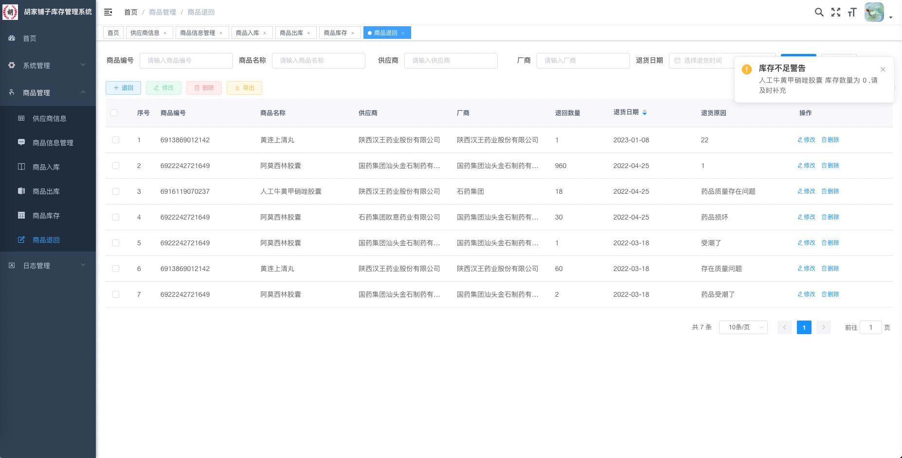

# 商品库存出入库管理系统

### 项目地址
http://39.101.133.125:1024/index
账号:ry
密码:admin123

## 此账号为演示账号, 权限较低, 如果需要较高权限账号请联系作者
## 作者QQ：1556708905, 需要指导请加QQ

#### 介绍
系统前后端分离，前端使用vue，后端Java。主要实现了供应商信息和商品信息的增、删、改、查、导入、导出的基本信息管理功能，以及商品入库、出库、退回和库存的管理功能，其中 商品入库时能实时的展示商品到期时间及对即将要过期和已过期商品进行系统 警告提示。
系统有商品管理员和超级管理员两种角色，商品管理员能管理商品，超级管理员除商品外还能进行用户管理，部门管理等以及日志查看管理。

#### 系统环境版本说明
JDK >= 1.8 

Mysql >= 5.7.0

Redis >= 3.0

Maven >= 3.0

Node >= 12

#### 使用说明

1、后端运行：

(1)将项目导入到IntelliJ IDEA中

(2)创建数据库ly，并执行ly.sql数据脚本

(3)修改数据库连接，编辑resources目录下的application-druid.yml，将数据库账号密码改为自己本地的

(4)配置redis编辑resources目录下的application.yml，可配置redis（默认无密码）

(5)启动redis后，再启动RuoYiApplication.java即可运行系统。

2、前端运行：

(1)cd ruoyi-ui

(2)使用npm install安装依赖（不建议通过cnpm或其它进行安装 可能会丢包）

(3)在终端使用npm run dev来启动项目

1.  登录（验证码功能已关闭，可参考若依开启验证码功能）。

登录包括两种不同的风格，一种是背景图，一种是`three.js`粒子动效。默认样式为背景图，若要更换则将`src/views/login1.vue`和`login.vue`文件名进行更改，让你想使用的样式的文件名为`login.vue`则可。（两个文件只能有一个名为`login.vue`,那个名为login.vue则就是那个样式）

2.  首页

3.  商品管理

  1） 商品供应商管理  

  2） 商品信息管理

  3） 商品入库管理

  4） 商品出库管理

  5） 商品库存管理

商品流水

  

6） 商品回退管理

4. 系统管理和日志管理模块为[若依系统](http://www.ruoyi.vip/)模块。
